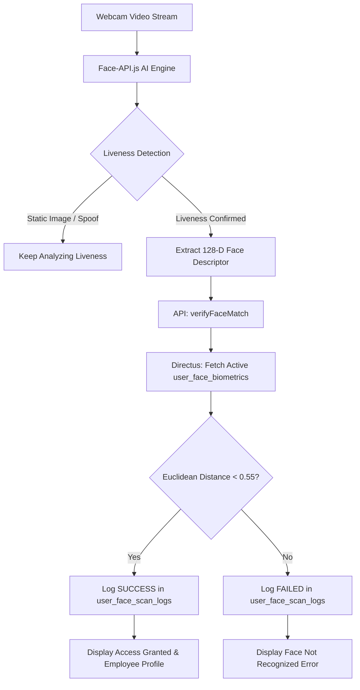

# 🛡️ Face Recognition Test & Simulator Documentation

This document outlines the architecture, workflow, liveness validation, and testing procedure for the **Face Recognition Simulator** module in the Human Resource Management System.

---

## 📌 1. Overview & Purpose

The **Face Recognition Test Module** simulates an attendance terminal / access control kiosk. It validates whether an employee's face captured via a live webcam matches an enrolled biometric vector stored in the database.

- **Route:** `/hrm/employee-admin/face-recognition-test`
- **Module Path:** [`src/modules/human-resource-management/employee-admin/face-recognition-test/`](file:///c:/Users/ace_c/Desktop/Vertex%20Files/system/Vos%20Update/human-resource-management/src/modules/human-resource-management/employee-admin/face-recognition-test)
- **Enrollment Dependency:** Employees must first be registered via [`/hrm/employee-admin/face-biometrics-registry`](file:///c:/Users/ace_c/Desktop/Vertex%20Files/system/Vos%20Update/human-resource-management/src/app/(human-resource-management)/hrm/employee-admin/face-biometrics-registry/page.tsx).

---

## ⚙️ 2. System Architecture & Component Breakdown

### Key Files

| File | Purpose |
| :--- | :--- |
| [`FaceRecognitionTestModule.tsx`](file:///c:/Users/ace_c/Desktop/Vertex%20Files/system/Vos%20Update/human-resource-management/src/modules/human-resource-management/employee-admin/face-recognition-test/FaceRecognitionTestModule.tsx) | Root page container and header layout. |
| [`ScannerTerminal.tsx`](file:///c:/Users/ace_c/Desktop/Vertex%20Files/system/Vos%20Update/human-resource-management/src/modules/human-resource-management/employee-admin/face-recognition-test/components/ScannerTerminal.tsx) | Live camera feed, liveness detection algorithm, scan loop, and result cards. |
| [`fetchProvider.ts`](file:///c:/Users/ace_c/Desktop/Vertex%20Files/system/Vos%20Update/human-resource-management/src/modules/human-resource-management/employee-admin/face-biometrics-registry/providers/fetchProvider.ts) | Backend provider with `verifyFaceMatch()` calculating Euclidean distances and recording audit logs. |

---

## 🔄 3. Step-by-Step Operating Workflow

### Step 1: AI Model Initialization
When the page loads, `face-api.js` loads three neural network models from `/public/models`:
1. **SSD MobileNet V1 (`ssdMobilenetv1`)**: High-accuracy face detection.
2. **Face Landmark 68 Net (`faceLandmark68Net`)**: Detects 68 facial points (eyes, nose, mouth, jawline).
3. **Face Recognition Net (`faceRecognitionNet`)**: Computes a 128-dimensional floating point feature vector.

### Step 2: Terminal Activation
- The administrator or user clicks **"Activate Terminal"**.
- Browser requests camera permissions (`getUserMedia`).
- Video stream mounts to the `<video>` element with an alignment guide.

### Step 3: Anti-Spoofing & Liveness Check
Before comparing faces, the terminal performs a real-time **passive liveness check** to protect against printed photos or smartphone screen spoofing:
- Tracks the distance between the left eye and nose tip relative to the inter-ocular distance (`IOD`):
  $$\text{Ratio} = \frac{\text{Distance}(\text{Left Eye}, \text{Nose})}{\text{Distance}(\text{Left Eye}, \text{Right Eye})}$$
- Maintains a sliding window of the last 4 frames.
- Calculates ratio variance across frames.
- **Verification Rule:** If $\text{Variance} > 0.0015$, natural human micro-movement or blinking is confirmed $\rightarrow$ Proceed to matching.
- **Status Overlay:** Displays *"Analyzing Liveness..."*.

### Step 4: Biometric Matching (`verifyFaceMatch`)
Once liveness is verified:
1. Computes the live face's 128-D descriptor vector: $D_{\text{live}} = [d_1, d_2, ..., d_{128}]$.
2. Queries Directus collection `user_face_biometrics` where `is_active = true`.
3. Calculates Euclidean distance $L_2$ between the live face and every enrolled face:
   $$L_2 = \sqrt{\sum_{i=1}^{128} (D_{\text{live}}[i] - D_{\text{stored}}[i])^2}$$
4. **Matching Threshold:**
   - **Threshold:** $\le 0.55$ (Industry standard for `face-api.js`).
   - If distance $< 0.55$, the identity with the lowest distance is selected as the match.

### Step 5: Audit Logging & Visual Confirmation
- **Audit Logging:** Every scan sends an audit entry to `user_face_scan_logs`:
  - `user_id`: Matched user ID or `null`.
  - `scan_status`: `"SUCCESS"` or `"FAILED"`.
  - `confidence_score`: Euclidean distance score.
- **Visual Display:**
  - **SUCCESS:** 
    - Green banner: *"Face verified successfully! Access Granted."*
    - Employee Profile card displaying avatar, full name, email, and *"Access Granted"* badge.
    - Automatically resets after **5 seconds** for the next person.
  - **FAILED:** 
    - Red banner: *"Face not recognized in the system."*
    - Automatically resets after **3 seconds**.
  - **Manual Reset:** Click **"Reset Terminal Now"** to instantly clear state.

---

## 🗄️ 4. Database Schema Requirements

### 1. `user_face_biometrics`
Stores the enrolled biometric references.

| Column | Type | Description |
| :--- | :--- | :--- |
| `id` | `INTEGER` (PK) | Primary identifier |
| `user_id` | `INTEGER` | Linked employee user ID |
| `face_encoding` | `TEXT` | JSON array of 128 float values |
| `image_reference_path`| `VARCHAR(255)` | Directus file ID of reference photo |
| `is_active` | `BOOLEAN` | Active template flag (default: `true`) |
| `registered_by` | `INTEGER` | Administrator who enrolled the employee |
| `registered_at` | `TIMESTAMP` | Timestamp of enrollment |

### 2. `user_face_scan_logs`
Audit log of all access terminal scan attempts.

| Column | Type | Description |
| :--- | :--- | :--- |
| `id` | `INTEGER` (PK) | Primary identifier |
| `user_id` | `INTEGER` (Nullable) | Matched user ID (`null` if failed) |
| `scan_status` | `VARCHAR(50)` | `"SUCCESS"` or `"FAILED"` |
| `confidence_score` | `DECIMAL(5,4)` | Euclidean distance metric |
| `date_created` | `TIMESTAMP` | Scan timestamp |

---

## 🧪 5. Testing Checklist

1. **Prerequisite Check**:
   - Go to `/hrm/employee-admin/face-biometrics-registry` and ensure at least one employee is enrolled with an active face biometric.
2. **Terminal Activation**:
   - Navigate to `/hrm/employee-admin/face-recognition-test`.
   - Click **"Activate Terminal"** and allow webcam permissions.
3. **Positive Match Test**:
   - Have the registered employee look straight at the camera.
   - Verify that *"Analyzing Liveness..."* triggers, followed by *"Analyzing Face..."*.
   - Verify the green *"Access Granted"* card appears with the correct employee name and photo.
   - Verify the terminal automatically resets after 5 seconds.
4. **Negative Match Test**:
   - Have an un-enrolled person stand in front of the camera.
   - Verify that after liveness analysis, the red *"Face not recognized in the system"* card appears.
5. **Anti-Spoofing Test**:
   - Hold up a static printed photo of the registered employee in front of the camera.
   - Verify that the terminal remains in *"Analyzing Liveness..."* and does **not** grant access without micro-movement.

---

## 🛠️ 6. Troubleshooting

- **Error: "Failed to load facial recognition models"**:
  Ensure weights exist under `public/models/` (`ssd_mobilenetv1_model-*`, `face_landmark_68_model-*`, `face_recognition_model-*`).
- **Error: "You don't have permission to access collection user_face_biometrics"**:
  In Directus Admin Settings $\rightarrow$ Roles & Permissions, ensure the role for `DIRECTUS_STATIC_TOKEN` has read permissions on `user_face_biometrics` and create permissions on `user_face_scan_logs`.
- **False Negatives (Enrolled face not recognized)**:
  Ensure adequate frontal lighting, avoid backlighting, and align the face within 1.5–3 feet of the webcam.
